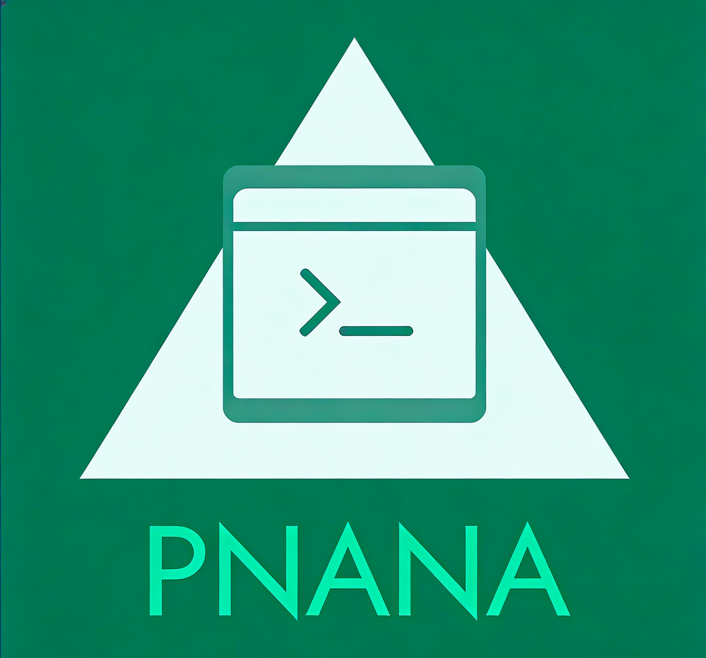

<div align="center">



# pnana - Modern Terminal Text Editor


[中文](README.md) | **English**

**pnana** is a modern terminal text editor built with FTXUI, inspired by Nano, Micro, and Sublime Text. It provides a friendly user interface, intuitive keyboard shortcuts, and powerful editing features.

</div>

## 📸 Demo

<div align="center">


</div>

## ✨ Core Features

### 🎨 Beautiful and Friendly Interface
- **Multiple Themes**: Monokai (default), Dracula, Solarized Dark/Light, OneDark, Nord...
- **Three-Column Layout**: Top menu bar, middle editing area, bottom help bar
- **Smart Status Bar**: Displays file information, cursor position, encoding, and modification status
- **Line Numbers**: Switch between absolute and relative line numbers
- **Current Line Highlighting**: Clearly identifies the editing position

### ⌨️ Modern Keyboard Shortcuts
Abandoning the learning curve of traditional Vim, pnana adopts intuitive shortcuts from modern editors. Use familiar standard shortcuts like `Ctrl+S` to save, `Ctrl+Z` to undo, with zero learning curve.

**Complete Shortcut List**: See [Keyboard Shortcuts Documentation](docs/KEYBINDINGS.md)

### 📝 Powerful Editing Features

#### Multi-File Support
- **Tab System**: Open multiple files simultaneously
- **Split Editing**: Horizontal/vertical split screens （planned）
- **Quick Switching**: Fast file switching with keyboard 

#### Smart Editing
- **Auto Indent**: Intelligent indentation based on file type (planned)
- **Bracket Matching**: Auto-complete brackets and quotes (planned)
- **Multi-Cursor Editing**: Edit multiple positions simultaneously (planned)
- **Column Selection**: Hold Alt for column selection
- **Smart Undo/Redo**: Unlimited undo/redo

#### Search and Replace
- **Regular Expressions**: Support for regex search
- **Case Sensitive**: Optional case matching
- **Batch Replace**: Replace all matches at once
- **Live Preview**: Real-time search result highlighting

#### Syntax Highlighting
Supports multiple programming languages: C/C++, Python, JavaScript/TypeScript, Java, Go, Rust, Ruby, PHP, HTML/CSS, JSON, XML, Markdown, Shell, SQL, YAML, TOML

#### LSP Support (Language Server Protocol)
- **Code Completion**: Intelligent code completion for multiple programming languages
- **Real-time Diagnostics**: Syntax errors and warnings displayed in real-time
- **Code Navigation**: Jump to definition, find references
- **Symbol Search**: Quickly find functions, classes, variables, and more
- **Auto Configuration**: Automatically detects and configures LSP servers

**Detailed LSP Guide**: See [LSP Documentation](docs/LSP.md)

#### Lua Plugin System （Planed）
- **Powerful Extensibility**: Write plugins in Lua to easily extend editor functionality
- **Rich API**: Complete editor API supporting file operations, cursor control, event listening, and more
- **Easy to Use**: Inspired by Neovim's design, plugin development is simple and intuitive
- **Auto Loading**: Plugins are automatically discovered and loaded, no manual configuration needed

**Detailed Plugin Development Guide**: See [Plugin Documentation](docs/PLUGIN_DEVELOPMENT.md)

### 🔧 Configuration System
Simple JSON configuration file supporting themes, fonts, indentation, and other settings.

**Detailed Configuration Guide**: See [Configuration Documentation](docs/CONFIGURATION.md)

## 🚀 Quick Start

### Build Requirements
**[Dependencies Documentation](docs/DEPENDENCIES.md)** - Project dependencies and installation

### Build and Install

```bash
# Clone repository
cd /path/to/pnana
chmod +x ./build.sh

# Build project
./build.sh

# Run pnana
./build/pnana

# Or install to system
cd build
sudo make install
pnana filename.txt
```

### Usage Examples

```bash
# Start blank editor
pnana

# Open single file
pnana file.txt

# Specify config file
pnana --config ~/.config/pnana/config.json

# Use specific theme
pnana --theme dracula file.txt

```

## 📖 Documentation

Detailed documentation and guides are available in the [docs](docs/) folder:

- **[Keyboard Shortcuts Reference](docs/KEYBINDINGS.md)** - Complete shortcut list and usage instructions
- **[Configuration Documentation](docs/CONFIGURATION.md)** - Detailed configuration options and examples
- **[Plugin Development Guide](docs/PLUGIN_DEVELOPMENT.md)** - Lua plugin API & examples | **[LSP Support](docs/LSP.md)**
- **[Dependencies Documentation](docs/DEPENDENCIES.md)** - Project dependencies and installation guide
- **[Development Roadmap](docs/ROADMAP.md)** - Version plans and feature roadmap
- **[Product Comparison](docs/COMPARISON.md)** - Detailed comparison with similar products
- **[Quick Start Guide](QUICKSTART.md)** - 5-minute quick start guide


## 💡 Why Choose pnana?

1. **Zero Learning Curve**: Use familiar Ctrl shortcuts, no need to memorize complex commands
2. **Ready to Use**: Get an excellent editing experience without configuration
3. **Modern Design**: Beautiful UI and comfortable color schemes
4. **Lightweight and Efficient**: Terminal-based, low resource usage, fast startup
5. **Feature Complete**: Feature set comparable to GUI editors

## 🤝 Comparison with Similar Products

| Feature | pnana | Nano | Micro | Vim/Neovim |
|---------|-------|------|-------|------------|
| Learning Curve | Low | Low | Low | High |
| Modern UI | ✅ | ❌ | ✅ | Requires config |
| Mouse Support | ❌ | ⚠️ | ✅ | Requires config |
| Syntax Highlighting | ✅ | ⚠️ | ✅ | ✅ |
| Multi-File | ✅ | ❌ | ✅ | ✅ |
| Plugin System | ✅ | ❌ | ✅ | ✅ |
| LSP Support | ✅ | ❌ | ✅ | ✅ |
| Simple Configuration | ✅ | ✅ | ✅ | ❌ |

**Detailed Comparison**: See [Product Comparison Documentation](docs/COMPARISON.md)

## 📚 References and Inspiration

This project is inspired by the following excellent projects:
- [Nano](https://www.nano-editor.org/) - Simple and easy-to-use terminal editor
- [Micro](https://micro-editor.github.io/) - Modern terminal editor
- [Sublime Text](https://www.sublimetext.com/) - Classic text editor
- [VS Code](https://code.visualstudio.com/) - Modern IDE
- [FTXUI](https://github.com/ArthurSonzogni/FTXUI) - Powerful terminal UI library

## 📝 License

This project is licensed under the MIT License - see the LICENSE file for details.


## 🌟 Star History

[](https://star-history.com/#Cyxuan0311/PNANA&Date)

---


