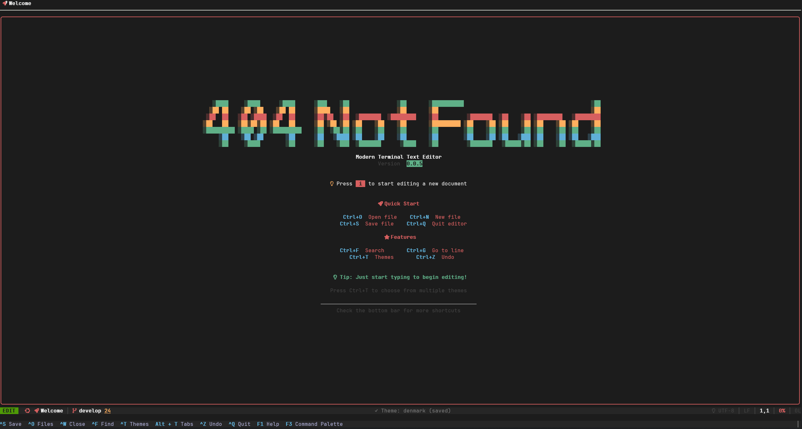
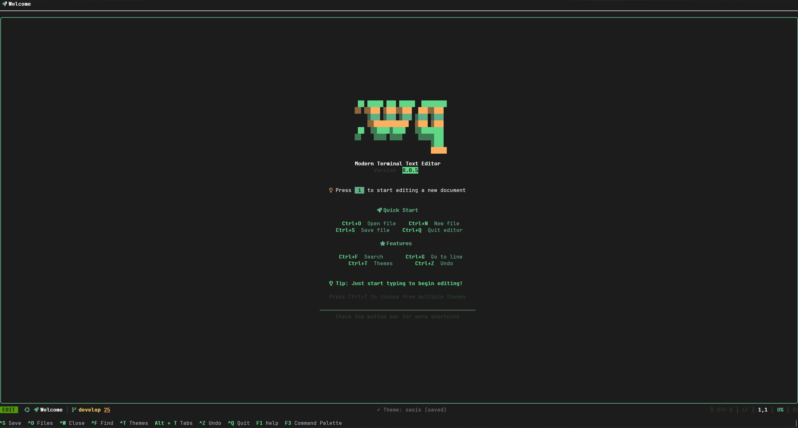
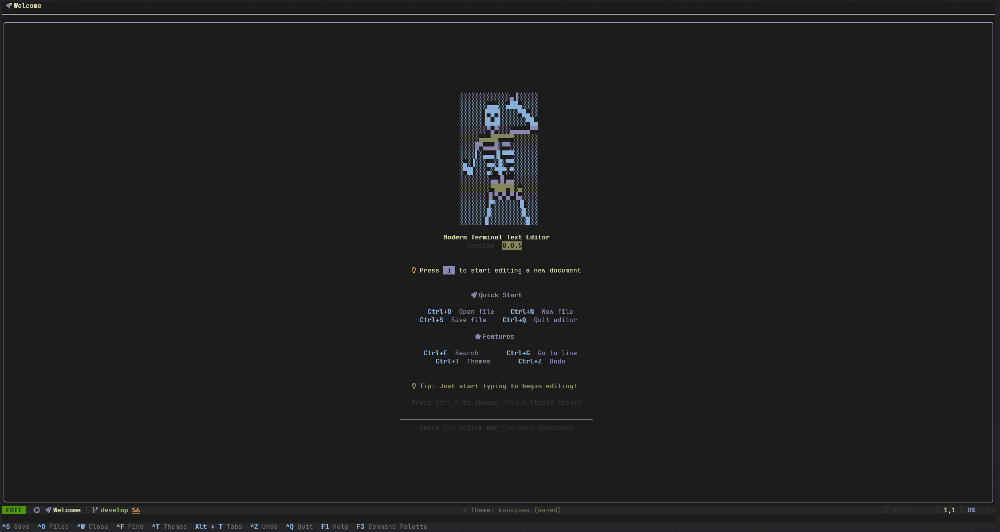

# pnana 配置文档

> [English](CONFIGURATION_EN.md) | 中文

本文档详细说明 pnana 的配置系统和使用方法。

## 📋 目录

- [配置文件位置](#配置文件位置)
- [配置选项说明](#配置选项说明)
- [智能缩进配置](#智能缩进配置)
- [LSP 配置](#lsp-配置)
- [History 配置](#history-配置)
- [配置示例](#配置示例)
- [配置文件格式](#配置文件格式)

---

## 配置文件位置

pnana 的配置文件位于：

```
~/.config/pnana/config.json
```

首次运行时，如果配置文件不存在，pnana 会自动创建默认配置文件。

---

## 配置选项说明

配置文件采用**嵌套 JSON 结构**，分为 `editor`、`display`、`files`、`search`、`themes`、`plugins`、`lsp`、`history`、`custom_logos`、`ui`、`language_indent` 等节。

### editor（编辑器）

| 配置项 | 类型 | 默认值 | 说明 |
|--------|------|--------|------|
| `theme` | string | `"monokai"` | 主题，可选：`monokai`, `dracula`, `solarized-dark`, `solarized-light`, `onedark`, `nord`, `gruvbox`, `tokyo-night`, `catppuccin`, `material`, `ayu`, `github`, `github-dark`, `github-dark-dimmed`, `github-dark-high-contrast`, `github-light-high-contrast`, `github-colorblind`, `github-tritanopia`, `github-soft`, `github-midnight`, `markdown-dark`, `vscode-dark`, `vscode-light`, `vscode-light-modern`, `vscode-dark-modern`, `vscode-monokai`, `vscode-dark-plus`, `night-owl`, `palenight`, `oceanic-next`, `kanagawa`, `tomorrow-night`, `tomorrow-night-blue`, `cobalt`, `zenburn`, `base16-dark`, `papercolor`, `rose-pine`, `everforest`, `jellybeans`, `desert`, `slate`, `atom-one-light`, `tokyo-night-day`, `blue-light`, `cyberpunk`, `hacker`, `hatsune-miku`, `minions`, `batman`, `spongebob`, `modus-vivendi`, `modus-operandi`, `horizon`, `oxocarbon`, `poimandres`, `midnight` 等 |
| `font_size` | number | `12` | 字体大小（像素） |
| `tab_size` | number | `4` | Tab 缩进空格数 |
| `insert_spaces` | boolean | `true` | 用空格替代 Tab 字符 |
| `word_wrap` | boolean | `false` | 是否自动换行 |
| `auto_indent` | boolean | `true` | 是否自动缩进 |

### display（显示）

| 配置项 | 类型 | 默认值 | 说明 |
|--------|------|--------|------|
| `show_line_numbers` | boolean | `true` | 是否显示行号 |
| `relative_line_numbers` | boolean | `false` | 是否使用相对行号 |
| `highlight_current_line` | boolean | `true` | 是否高亮当前行 |
| `show_whitespace` | boolean | `false` | 是否显示空白字符 |
| `cursor_style` | string | `"block"` | 光标样式：`block`, `underline`, `bar`, `hollow` |
| `cursor_color` | string | `"255,255,255"` | 光标颜色（RGB，逗号分隔） |
| `cursor_blink_rate` | number | `500` | 光标闪烁间隔（毫秒），0 不闪烁 |
| `cursor_smooth` | boolean | `false` | 流动光标效果 |
| `show_helpbar` | boolean | `true` | 是否显示底部帮助栏（快捷键提示） |
| `logo_gradient` | boolean | `true` | 欢迎界面 Logo 是否使用渐变颜色 |
| `show_tab_close_indicator` | boolean | `true` | 是否在标签页上显示关闭符号（×），未修改时显示×，已修改显示● |
| `file_browser_show_tree_style` | boolean | `true` | 是否显示树形结构样式（展开图标 ▼/▶ 和连接线 │/├─/└─）。设为 `false` 时使用空格缩进，不显示树形符号，界面更简洁 |
| `file_browser_side` | string | `"left"` | 文件列表面板相对于代码区的位置：`"left"`（左侧，默认）或 `"right"`（右侧） |
| `ai_panel_side` | string | `"right"` | AI 弹窗（AI Assistant 侧边栏）相对于代码区的位置：`"left"` 或 `"right"`（默认在右侧） |
| `terminal_side` | string | `"bottom"` | 终端面板相对于代码区的位置：`"bottom"`（下方，默认）或 `"top"`（上方） |
| `logo_style` | string | `"default"` | Logo 样式：`"default"`, `"ascii"`, `"big-ascii"`, 以及更多... |
| `statusbar_style` | string | `"default"` | 状态栏样式：`"default"`, `"neovim"`, `"vscode"`, `"minimal"`, `"classic"`, `"highlight"` |

### themes（主题）

`themes` 段用于控制当前主题、主题面板中可见的主题列表，以及用户自定义主题。

| 配置项 | 类型 | 默认值 | 说明 |
|--------|------|--------|------|
| `current` | string | `"monokai"` | 启动时使用的主题名称，需要是内置主题、插件提供的主题，或自定义主题名之一 |
| `available` | array\<string> | `[]`（自动） | 可选，用于指定主题菜单中显示的主题名称列表。如果留空或省略，则显示所有内置主题，并自动追加自定义主题 |
| `custom` | object | `{}` | 可选，自定义主题定义，键为主题名，值为颜色配置对象（见下） |

`themes.custom` 下每个子对象是一个颜色配置，使用 0–255 的 RGB 数组。所有字段都可选，但推荐至少填写这些：

```json
"themes": {
  "current": "my-dark",
  "available": ["monokai", "dracula", "my-dark"],
  "custom": {
    "my-dark": {
      "background": [10, 10, 10],
      "foreground": [230, 230, 230],
      "current_line": [25, 25, 25],
      "selection": [40, 40, 40],
      "line_number": [120, 120, 120],
      "line_number_current": [230, 230, 230],
      "statusbar_bg": [20, 20, 20],
      "statusbar_fg": [230, 230, 230],
      "menubar_bg": [20, 20, 20],
      "menubar_fg": [230, 230, 230],
      "helpbar_bg": [20, 20, 20],
      "helpbar_fg": [150, 150, 150],
      "helpbar_key": [166, 226, 46],
      "keyword": [249, 38, 114],
      "string": [230, 219, 116],
      "comment": [117, 113, 94],
      "number": [174, 129, 255],
      "function": [166, 226, 46],
      "type": [102, 217, 239],
      "operator": [249, 38, 114],
      "error": [249, 38, 114],
      "warning": [253, 151, 31],
      "info": [102, 217, 239],
      "success": [166, 226, 46]
    }
  }
}
```

未填写的字段会回退到内部默认颜色。定义完成后，自定义主题会与内置主题一起出现在主题选择面板中，可以正常预览和切换。

### files（文件）

| 配置项 | 类型 | 默认值 | 说明 |
|--------|------|--------|------|
| `encoding` | string | `"UTF-8"` | 编码：`UTF-8`, `GBK`, `GB2312`, `ASCII` |
| `line_ending` | string | `"LF"` | 行尾：`LF` (Unix), `CRLF` (Windows), `CR` (Mac) |
| `trim_trailing_whitespace` | boolean | `true` | 保存时删除行尾空白 |
| `insert_final_newline` | boolean | `true` | 保存时在文件末尾插入换行 |
| `auto_save` | boolean | `false` | 是否启用自动保存 |
| `auto_save_interval` | number | `60` | 自动保存间隔（秒） |
| `max_file_size_before_prompt_mb` | number | `50` | 打开文件前提示的最大文件大小（MB） |

### search（搜索）

| 配置项 | 类型 | 默认值 | 说明 |
|--------|------|--------|------|
| `case_sensitive` | boolean | `false` | 区分大小写 |
| `whole_word` | boolean | `false` | 全词匹配 |
| `regex` | boolean | `false` | 正则表达式 |
| `wrap_around` | boolean | `true` | 循环搜索 |

### custom_logos（自定义 Logo）

`custom_logos` 用于定义欢迎界面的自定义 Logo 列表。默认配置现已置空。

| 配置项 | 类型 | 默认值 | 说明 |
|--------|------|--------|------|
| `custom_logos` | array | `[]` | 自定义 Logo 列表。每项为对象，包含 `id`、`display_name`、`lines`（Logo 文本行数组） |

示例：

```json
"custom_logos": [
  {
    "id": "my_logo",
    "display_name": "My Logo",
    "lines": [
      "███",
      "PNANA"
    ]
  }
]
```

自定义 Logo 效果示例：







### ui（界面）

| 配置项 | 类型 | 默认值 | 说明 |
|--------|------|--------|------|
| `toast_enabled` | boolean | `false` | 是否启用 Toast 弹窗通知（如复制成功提示） |
| `toast_style` | string | `"classic"` | Toast 样式，可选：`classic`、`minimal`、`solid`、`accent`、`outline` |
| `toast_duration_ms` | number | `3000` | Toast 显示时长（毫秒），`0` 表示不自动消失（会持续显示直到被新 Toast 替换或手动隐藏） |
| `toast_max_width` | number | `50` | Toast 最大宽度（字符数） |
| `toast_show_icon` | boolean | `true` | 是否显示类型图标（成功/信息/警告/错误） |
| `toast_bold_text` | boolean | `false` | 是否将 Toast 文本加粗显示 |
| `max_recent_files` | number | `8` | 最近打开的文件最大数量 |
| `max_recent_folders` | number | `4` | 最近打开的文件夹最大数量 |

---

## 智能缩进配置

`language_indent` 段用于配置每种编程语言的智能缩进参数，包括缩进大小、是否使用空格、是否启用智能缩进，以及该语言支持的文件后缀列表。

### language_indent（语言缩进配置）

每个语言的配置包含以下字段：

| 配置项 | 类型 | 默认值 | 说明 |
|--------|------|--------|------|
| `indent_size` | number | `4` | 缩进空格数 |
| `insert_spaces` | boolean | `true` | 是否使用空格代替 Tab |
| `smart_indent` | boolean | `true` | 是否启用 Tree-sitter 智能缩进 |
| `file_extensions` | array\<string> | `[]` | 该语言支持的文件后缀列表 |

示例：

```json
"language_indent": {
  "python": {
    "indent_size": 4,
    "insert_spaces": true,
    "smart_indent": true,
    "file_extensions": [".py", ".pyw", ".pyi", ".python"]
  },
  "cpp": {
    "indent_size": 4,
    "insert_spaces": true,
    "smart_indent": true,
    "file_extensions": [".cpp", ".cxx", ".cc", ".c++", ".hpp", ".hxx", ".hh", ".h"]
  },
  "javascript": {
    "indent_size": 2,
    "insert_spaces": true,
    "smart_indent": true,
    "file_extensions": [".js", ".jsx", ".mjs", ".cjs", ".javascript"]
  },
  "go": {
    "indent_size": 4,
    "insert_spaces": true,
    "smart_indent": true,
    "file_extensions": [".go"]
  },
  "rust": {
    "indent_size": 4,
    "insert_spaces": true,
    "smart_indent": true,
    "file_extensions": [".rs"]
  }
}
```

### 智能缩进模块说明

pnana 的智能缩进模块基于 **Tree-sitter** 语法解析器实现，能够根据代码的抽象语法树（AST）自动计算正确的缩进级别。

#### 工作原理

1. **Tree-sitter 解析**：当按下回车键时，系统会使用 Tree-sitter 解析当前文件的 AST
2. **查询匹配**：根据语言的 `indents.scm` 查询文件（如果存在）或硬编码逻辑，识别代码块结构
3. **缩进计算**：向上遍历 AST 节点，统计需要缩进的层级，计算最终缩进级别
4. **应用缩进**：将计算出的缩进应用到新行

#### 特性

- **语言特定配置**：每种语言可以自定义缩进大小、是否使用空格等
- **文件后缀匹配**：通过 `file_extensions` 列表自动识别文件类型并应用对应语言的缩进规则
- **智能回退**：如果 Tree-sitter 不可用或解析失败，会自动回退到基于括号的简单缩进逻辑
- **性能优化**：使用范围限制查询，确保即使在大型文件中也能快速响应

#### 配置优先级

1. **用户配置**：`~/.config/pnana/config.json` 中的 `language_indent` 配置
2. **内置默认**：代码中硬编码的语言默认配置
3. **通用默认**：如果语言未在配置中定义，使用通用默认值（4 空格）

---

## LSP 配置

pnana 支持通过配置文件自定义 LSP（Language Server Protocol）语言服务器。**当配置文件中某条 `servers` 的 `language_id` 与代码内置的某一语言重复时，以配置文件中的该项为准**；若配置里某项未填或不可用，会回退使用内置的对应字段。仅当 `language_id` 在内置中不存在时，该条会作为新语言追加。

### lsp（语言服务器）

| 配置项 | 类型 | 默认值 | 说明 |
|--------|------|--------|------|
| `enabled` | boolean | `true` | 是否启用 LSP。设为 `false` 可完全禁用语言服务器 |
| `completion_popup_enabled` | boolean | `true` | 是否显示代码补全提示弹窗。设为 `false` 可关闭输入时的补全弹窗 |
| `servers` | array | `[]` | 服务器配置。与内置同 language_id 时以本配置为准；空字段用内置兜底；新 language_id 会追加 |

### 单个服务器配置格式

每个 `servers` 数组元素为一个对象，包含以下字段：

| 字段 | 类型 | 必填 | 说明 |
|------|------|------|------|
| `name` | string | 是 | 服务器名称（用于标识） |
| `command` | string | 是 | 启动命令（如 `clangd`、`python3`） |
| `language_id` | string | 是 | LSP 语言 ID（如 `cpp`、`python`、`go`） |
| `extensions` | array | 是 | 支持的文件扩展名，如 `[".cpp", ".c", ".h"]` |
| `args` | array | 否 | 命令行参数，如 `["-m", "pylsp"]` |
| `env` | object | 否 | 环境变量。不填时自动使用 `XDG_CACHE_HOME`、`TMPDIR` 等默认值 |

### 内置默认服务器（可被同 language_id 的配置覆盖，未配置项使用下表）

| 语言 | 命令 | 扩展名 |
|------|------|--------|
| C/C++ | `clangd` | `.cpp`, `.c`, `.h`, `.hpp`, `.cc`, `.cxx` 等 |
| Python | `python3` | `.py`, `.pyw`, `.pyi` |
| Go | `gopls` | `.go` |
| Rust | `rust-analyzer` | `.rs` |
| Java | `jdtls` | `.java` |
| TypeScript | `typescript-language-server` | `.ts`, `.tsx`, `.mts`, `.cts` |
| JavaScript | `typescript-language-server` | `.js`, `.jsx`, `.mjs`, `.cjs` |
| HTML | `html-languageserver` | `.html`, `.htm` |
| CSS | `css-languageserver` | `.css`, `.scss`, `.less`, `.sass` |
| JSON | `json-languageserver` | `.json`, `.jsonc` |
| YAML | `yaml-language-server` | `.yaml`, `.yml` |
| Markdown | `marksman` | `.md`, `.markdown` |
| Shell | `bash-language-server` | `.sh`, `.bash`, `.zsh` |

## History 配置

`history` 段用于控制历史版本自动清理策略，历史文件存放在：

`~/.config/pnana/history/`

| 配置项 | 类型 | 默认值 | 说明 |
|--------|------|--------|------|
| `enable` | boolean | `true` | 是否启用自动清理 |
| `max_entries` | number | `50` | 单文件最多保留的非关键版本数 |
| `max_age_days` | number | `30` | 最大保留天数（关键版本和最新版本除外） |
| `max_total_size` | string | `"1GB"` | 单文件历史目录大小上限（支持 `KB/MB/GB`） |
| `keep_critical_versions` | boolean | `true` | 清理时是否保留关键版本 |
| `critical_change_threshold` | number | `50` | 变更行比例 >= 该百分比时标记为关键版本 |
| `critical_time_interval` | number | `86400` | 与上个版本间隔秒数 >= 该值时标记为关键版本 |

示例：

```json
"history": {
  "enable": true,
  "max_entries": 50,
  "max_age_days": 30,
  "max_total_size": "1GB",
  "keep_critical_versions": true,
  "critical_change_threshold": 50,
  "critical_time_interval": 86400
}
```

### LSP 配置示例

**使用内置默认（推荐初次使用）：**

```json
"lsp": {
  "enabled": true,
  "servers": []
}
```

**覆盖 Python 命令（如使用虚拟环境）：**

```json
"lsp": {
  "enabled": true,
  "servers": [
    {
      "name": "pylsp",
      "command": "/path/to/venv/bin/python",
      "language_id": "python",
      "extensions": [".py", ".pyw", ".pyi"],
      "args": ["-m", "pylsp"],
      "env": {}
    }
  ]
}
```

**仅启用部分语言服务器：**

```json
"lsp": {
  "enabled": true,
  "servers": [
    {
      "name": "clangd",
      "command": "clangd",
      "language_id": "cpp",
      "extensions": [".cpp", ".c", ".h", ".hpp", ".cc", ".cxx"],
      "args": [],
      "env": {}
    },
    {
      "name": "pylsp",
      "command": "python3",
      "language_id": "python",
      "extensions": [".py", ".pyw", ".pyi"],
      "args": ["-m", "pylsp"],
      "env": {}
    }
  ]
}
```

**完全禁用 LSP：**

```json
"lsp": {
  "enabled": false,
  "servers": []
}
```

**添加自定义语言服务器（如 Lua）：**

```json
"lsp": {
  "enabled": true,
  "servers": [
    {
      "name": "lua-language-server",
      "command": "lua-language-server",
      "language_id": "lua",
      "extensions": [".lua"],
      "args": [],
      "env": {}
    }
  ]
}
```

> **注意**：自定义 `servers` 时，需自行安装对应的语言服务器（如 `clangd`、`pylsp`、`gopls` 等）。修改配置后需重新加载配置或重启 pnana 生效。

---

## 配置示例

### 基础配置

```json
{
  "editor": {
    "theme": "monokai",
    "font_size": 12,
    "tab_size": 4,
    "insert_spaces": true,
    "word_wrap": false,
    "auto_indent": true
  },
  "display": {
    "show_line_numbers": true,
    "relative_line_numbers": false,
    "highlight_current_line": true,
    "show_whitespace": false,
    "cursor_style": "block",
    "cursor_color": "255,255,255",
    "cursor_blink_rate": 500,
    "cursor_smooth": false,
    "show_helpbar": true,
    "logo_gradient": true,
    "logo_style": "default",
    "show_tab_close_indicator": true,
    "file_browser_show_tree_style": true,
    "file_browser_side": "left",
    "ai_panel_side": "right",
    "terminal_side": "bottom",
    "statusbar_style": "default"
  },
  "files": {
    "encoding": "UTF-8",
    "line_ending": "LF",
    "trim_trailing_whitespace": true,
    "insert_final_newline": true,
    "auto_save": false,
    "auto_save_interval": 60,
    "max_file_size_before_prompt_mb": 50
  },
  "search": {
    "case_sensitive": false,
    "whole_word": false,
    "regex": false,
    "wrap_around": true
  },
  "themes": { "current": "monokai", "available": [], "custom": {} },
  "plugins": { "enabled_plugins": [] },
  "custom_logos": [],
  "ui": {
    "toast_enabled": false,
    "toast_style": "classic",
    "toast_duration_ms": 3000,
    "toast_max_width": 50,
    "toast_show_icon": true,
    "toast_bold_text": false,
    "max_recent_files": 8,
    "max_recent_folders": 4
  },
  "lsp": { "enabled": true, "completion_popup_enabled": true, "servers": [] }
}
```

### 开发者配置

```json
{
  "editor": {
    "theme": "dracula",
    "font_size": 14,
    "tab_size": 2,
    "insert_spaces": true,
    "word_wrap": false,
    "auto_indent": true
  },
  "display": {
    "show_line_numbers": true,
    "relative_line_numbers": true,
    "highlight_current_line": true,
    "show_whitespace": true
  },
  "files": {
    "auto_save": true,
    "auto_save_interval": 30
  }
}
```

### 写作配置

```json
{
  "editor": {
    "theme": "solarized-light",
    "font_size": 16,
    "tab_size": 2,
    "word_wrap": true,
    "auto_indent": false
  },
  "display": {
    "show_line_numbers": false,
    "highlight_current_line": false
  },
  "files": {
    "auto_save": true,
    "auto_save_interval": 60
  }
}
```

---

## 配置文件格式

配置文件使用 JSON 格式，必须符合以下要求：

1. **文件编码**：UTF-8
2. **格式**：标准 JSON 格式
3. **注释**：JSON 不支持注释，如需注释请使用外部文档

### 配置验证

pnana 在启动时会验证配置文件：
- 如果配置文件格式错误，会使用默认配置并提示用户
- 如果缺少某个配置项，会使用该配置项的默认值
- 如果配置项值无效，会使用默认值并提示用户

---

## 配置优先级

配置的优先级从高到低：

1. **用户配置文件** (`~/.config/pnana/config.json`)
2. **默认配置** - 最低优先级

---

## 配置热重载

当前版本暂不支持配置热重载，修改配置文件后需要重启 pnana 才能生效。

未来版本计划支持：
- 配置文件变更检测
- 自动重新加载配置
- 部分配置项实时生效

---

## 常见问题

### Q: 配置文件在哪里？

A: 配置文件位于 `~/.config/pnana/config.json`。如果不存在，pnana 会在首次运行时自动创建。

### Q: 如何重置为默认配置？

A: 删除或重命名配置文件，pnana 会在下次启动时重新创建默认配置。

### Q: 可以同时使用多个配置文件吗？

A: 每次只能使用一个配置文件。

### Q: 配置文件中可以添加注释吗？

A: 标准 JSON 格式不支持注释。如果需要注释，请使用外部文档记录。

### Q: 如何备份配置？

A: 直接复制 `~/.config/pnana/config.json` 文件即可。

### Q: LSP 不工作怎么办？

A: 1) 确认 `lsp.enabled` 为 `true`；2) 若使用自定义 `servers`，确保已安装对应语言服务器（如 `clangd`、`pylsp`）；3) `servers` 为空时使用内置默认，需保证系统 PATH 中能找到默认命令。

---

## 更新日志

- **v0.0.5**：初始配置系统
- 支持 JSON 格式配置文件
- **LSP 配置**：支持通过 `lsp` 节配置语言服务器，可自定义命令、扩展名、参数及环境变量

---

**注意**：本文档基于当前版本的配置系统。如有更新，请参考最新代码。

